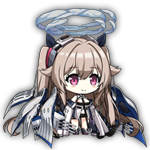
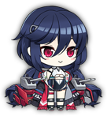
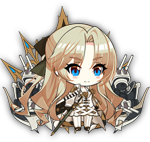
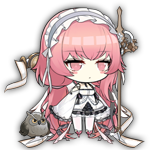
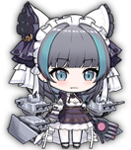
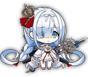
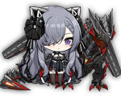

# Azur Lane Fleet Composition
Hey there! I'm *TwinShadow*, or as I'm known on GitHub, *TwinDragon*! Many who know me will know that I play the mobile game Azur Lane and have been since it came out. I also run the guild __Waifu War II__, where it's nothing but floofy touching of all the floofs! My UID for the game is **67138388**, not that anyone will add me. lol... However, I'm always looking for guild mates, so if you happen to be on **Avrora**, by all means come join! Our guild ID: **67109908**.

Down below you'll find a basic table of my current fleet composition of girls I use for the game. I will only list the main fleets of the 4 major factions of the game. It's partly just to keep track of my many fleets, but feel free to take some inspiration for your own fleets.

Each section will also have a dedicated file for which faction they belong in that details what equipment they have equipped, along with images. I might list recommended equipment, but that's for later. Anyway, enjoy the boat girls!

*Note: The first slot will be considered the flagship in the main fleet and command ship of the vanguard. This will be how you add the boats in your fleet basically.*  
*Note 2: Meowfficers will not be included. Their buffs are nice to have, but not an overall factor.*  
*Note 3: **Kai** refers to retrofitting. If you see this, it means they were retrofitted completely.*

## Azur Lane / USS
### Enterprise
| Chibi | Name | Class | Reason 
| --- | --- | --- | --- |
|  | New Jersey | BB | 

Flagship BB of the USS Fleet.
She gets big guns, her own special kind. She also has a barrage that fires off frequently. She rivals, if not beat, in power to **Friedrich der Grosse**.

|  | Enterprise | CV | 

She hits **HARD**.
If her skill procs, her aircraft will double their damage output.

|  | Essex | CV | 

Protection carrier, and some additional effects.
She provides some pretty good buffs to herself when in a USS fleet, not to mention helping out your ships in certain cases.

| Chibi | Name | Class | Reason 
| --- | --- | --- | --- |
|  | Anchorage | CA | 

Protector of your frontline.
She hit's pretty hard if you give her the right gun, and she protects your fleet when first sortied for a few seconds, and any time it procs after that. She even has a chance to pop a smokescreen which will help evasion temporarily.

|  | Allen M. Sumner | DD | 

You want AA? She's got you covered in AA.
With a barrage that procs fairly often if you give her a quick-firing gun, she's really your AA bolster if you need more AA. Equip her with an Eagle Union gear and she'll gain an additional Ghost AA Gun to take with her.

|  | Montpelier | CL | 

Cleveland, but better.
Montpelier is the younger Cleveland-class, improving on her namesake in many ways. She also helps out your other cruisers as well.

## Sakura Empire / IJN
### Kitsune
| Chibi | Name | Class | Reason 
| --- | --- | --- | --- |
|  | Nagato | BB | 

Glory to the Sakura Empire!
Not only is she a smol fox, she will help you carry your fleet to glory. She has a very powerful barrage if it goes off, and she buffs your IJN carriers to boot. You don't mess with this little thing.

|  | Akagi | CV | 

You don't take her, you die...
A scary 9-tailed fox that will kill you if you so much as look at another woman... A powerful carrier and when sortied with her sister, Kaga, they buff each other and have an early launch of aircraft. Very formiddable carriers.

|  | Kaga | CV | Look at Akagi.

| Chibi | Name | Class | Reason 
| --- | --- | --- | --- |
|  | Mogami Kai | CA | 

Better than the Atago sisters.
She makes HE guns actually work in your favor, and has a defense against AP ammo to boot. Hits hard, good armor, good boat to have in your fleet.

|  | Shimakaze | DD | 

Two preload torps? Hell yeah!
Shimakaze comes preloaded with two torps to fire off. She also fires a slash barrage every time they are fired. She also procs her gun barrage very often, so focus on those if you want her to succeed with one of the highest damaging torpedoes in the game.

|  | Jintsuu Kai | CL | 

The fox that helps the demon.
Jintsuu buffs all your DD and CL torps while she's afloat, including crits. Pair her up with Ayanami and you've got a force to be reckoned with.

## Royal Navy / HMS
### Meido
| Chibi | Name | Class | Reason 
| --- | --- | --- | --- |
|  | Vanguard | BB | 

Royal Navy buffer and barrager.
When at full limit break, she will always fire a barrage every time her guns reload. She also buffs your Royal Navy ships, and as long as you equip at least one Royal Navy equipment, she'll get a boost in AA and a main gun spread reduction.

|  | Perseus | CVL | 

Your fleet will never die.
Perseus is a CVL that comes pre-loaded with two aircraft launches. On top of that, launch will heal your fleet. The only draw back is that her reload is abysmal due to this skill, but don't let that be a deterrent. Stagger her launches for the most effective healing.

|  | Illustrious | CV | 

My god those boobs... *cough*
In all seriousness, Illustrious is a defense-oriented CV, having 2 fighter slots and a skill that protects your vanguard from all damage for a few seconds when her aircraft launch.

| Chibi | Name | Class | Reason 
| --- | --- | --- | --- |
|  | Cheshire | CA | 

Royal Navy's answer to AA.
She's got some good self-buffs on herself, on top of dealing some pretty solid damage. Her first two waves of torps have a reduced load time, and each time she takes damage, she buffs herself even further every battle. (stacks 3 times per battle)

|  | Janus | DD | 

Shy little destroyer that does damage.
She's a shy one, but when it really matters, she'll help your fleet out. While her buffs are mainly for other J-Class DD's of the Royal Navy, I wouldn't focus on them. But her barrage causes a temporary debuff on enemies that take increased damage from DD's and CL's of your Royal Navy fleet.

|  | Neptune | CL | 

AA for your Queen.
She's got anti-air to back up your fleet from planes. Also, she boosts her own AP shells, so bring those too. And she can self-heal? What's not to like. She's a maid too.

## Iron Blood / KMS
### Ryuu
| Chibi | Name | Class | Reason 
| --- | --- | --- | --- |
|  | Graf Zeppelin | CV | 

The pinnacle of KMS carriers, she helps your vanguard too.
Graf Zeppelin is a good carrier to have. Not only does she buff your vanguard by reducing the damage they take, she gets a buff herself for each KMS ship up to a stack of 3. Equip her with KMS Aircraft and she'll carry you to glory.

|  | August von Parseval | CV | 

A KMS carrier that really carries your fleet.
She's a KMS carrier worthy of being in the fleet. When at Level 5 Fate Simulation, her aircraft launch guarantees the enemy to slow to 0, just long enough for aimed torpedo bombers to land every single hit, increasing alpha damage tremendously. She also launches an aerial barrage on top of this to cause light and medium armor enemies hit to take additional aviation damage. Equip her with an Iron Blood aircraft and she'll bring you glory to Iron Blood.

|  | Ulrich von Hutten | BB | 

Somewhat New Jersey for your KMS.
She fires a barrage everytime her main guns fire off, much like New Jersey. On top of that, she hits incredibly hard against others. On top of the other myriad of buffs or debuffs she does, very worthy to have in your fleet. As a sidenote, she typically performs better in off-flag position. However, if you have the out-of-ammo debuff on a map, put her as flagship instead.

| Chibi | Name | Class | Reason 
| --- | --- | --- | --- |
|  | Prinz Heinrich | CA | 

Big boat guns.
She's not remarkable, but she gets a self-buff for having another KMS boat in your fleet. And she always fires a barrage every 20 seconds, can't complain there.

|  | Z46 | DD | 

Feisty little boat with that barrage of hers.
She's a feisty one, as her AP barrage gets a buff from her skill, and she can hit rapidly too. Oh, and she buffs herself every time she fires down a plane. Buff timer resets every time, but does not stack.

|  | Leipzig Kai | CL | 

Cruiser buffer, and more speed!
Leipzig buffs your cruisers in the fleet, as well as increasing the speed of your vanguard. On top of this, she'll temporarily evade all enemy fire when her health is low, and a damage buff until the end of the battle.

## Submarines
*Subs are in a class of their own as they provide supplemental torpedo power. They can help if you have the extra oil to spare. In many cases, their barrages won't matter much, so put your favorite submarine as the first slot if you want.*

*Slower torps are recommended to use because they are more likely to hit than standard. However, if you do face more stationary bosses, then regular torpedoes could, in theory, have higher damage output.*

### Sakura Empire / IJN
| Chibi | Name | Class
| --- | --- | --- |
|  | I-168 | SS |
|  | I-19 | SS |
|  | I-13 | SSV |

### Iron Blood / KMS
| Chibi | Name | Class
| --- | --- | --- |
|  | U-96 | SS |
|  | U-101 | SS |
|  | U-81 | SS |

### Eagle Union / USS
| Chibi | Name | Class
| --- | --- | --- |
|  | Albacore | SS |
|  | Cavalla | SS |
|  | Archerfish | SS |