# Azur Lane Fleet Composition
Hey there! I'm *TwinShadow*, or as I'm known on GitHub, *TwinDragon*! Many who know me will know that I play the mobile game Azur Lane and have been since it came out. I also run the guild __Waifu War II__, where it's nothing but floofy touching of all the floofs! My UID for the game is **67138388**, not that anyone will add me. lol... However, I'm always looking for guild mates, so if you happen to be on **Avrora**, by all means come join! Our guild ID: **67109908**.

Down below you'll find a basic table of my current fleet composition of girls I use for the game. I will only list the main fleets of the 4 major factions of the game. It's partly just to keep track of my many fleets, but feel free to take some inspiration for your own fleets.

Each section will also have a dedicated file for which faction they belong in that details what equipment they have equipped, along with images. I might list recommended equipment, but that's for later. Anyway, enjoy the boat girls!

*Note: The first slot will be considered the flagship in the main fleet and command ship of the vanguard. This will be how you add the boats in your fleet basically.*  
*Note 2: Meowfficers will not be included. Their buffs are nice to have, but not an overall factor.*  
*Note 3: **Kai** refers to retrofitting. If you see this, it means they were retrofitted completely.*

## Azur Lane / USS
### Enterprise
| Chibi | Name | Class | Reason 
| --- | --- | --- | --- |
| 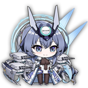 | New Jersey | BB | 

Flagship BB of the USS Fleet.
She gets big guns, her own special kind. She also has a barrage that fires off frequently. She rivals, if not beat, in power to **Friedrich der Grosse**.

| 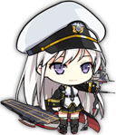 | Enterprise | CV | 

She hits **HARD**.
If her skill procs, her aircraft will double their damage output.

| 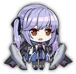 | Essex | CV | 

Protection carrier, and some additional effects.
She provides some pretty good buffs to herself when in a USS fleet, not to mention helping out your ships in certain cases.

| Chibi | Name | Class | Reason 
| --- | --- | --- | --- |
| 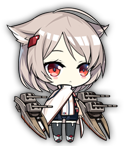 | Montpelier | CL | 

Cleveland, but better.
Montpelier is the younger Cleveland-class, improving on her namesake in many ways. She also helps out your other cruisers as well.

| 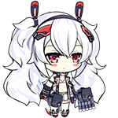 | Laffey Kai | DD | 

For a DD, she hits pretty hard.
An AP barrage along with torps? Why not. She also hits hard too and is all-around decent.

| 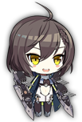 | Baltimore | CA | 

Hard hitting and CV buffing.
Baltimore hits hard, decent armor, and even buffs your CV's and CVL's in USS fleets. If you sortie without them, she'll buff herself instead. Also, she has a special AP ammo buff for her main gun.

## Sakura Empire / IJN
### Kitsune
| Chibi | Name | Class | Reason 
| --- | --- | --- | --- |
| 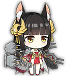 | Nagato | BB | 

Glory to the Sakura Empire!
Not only is she a smol fox, she will help you carry your fleet to glory. She has a very powerful barrage if it goes off, and she buffs your IJN carriers to boot. You don't mess with this little thing.

| 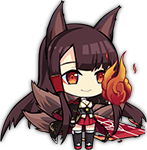 | Akagi | CV | 

You don't take her, you die...
A scary 9-tailed fox that will kill you if you so much as look at another woman... A powerful carrier and when sortied with her sister, Kaga, they buff each other and have an early launch of aircraft. Very formiddable carriers.

| 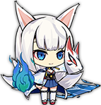 | Kaga | CV | Look at Akagi.

| Chibi | Name | Class | Reason 
| --- | --- | --- | --- |
| 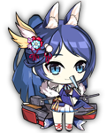 | Jintsuu Kai | CL | 

The fox that helps the demon.
Jintsuu buffs all your DD and CL torps while she's afloat, including crits. Pair her up with Ayanami and you've got a force to be reckoned with.

| 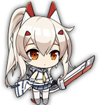 | Ayanami Kai | DD | 

*THE* Torp Goddess.
Ayanami is the torpedo goddess of the game, so spec'ing her out accordingly is key. But don't count on those guns of hers. Her barrage also launches powerful torpedoes along with decent self-buffs as well.

| 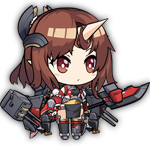 | Mogami Kai | CA | 

Better than the Atago sisters.
She makes HE guns actually work in your favor, and has a defense against AP ammo to boot. Hits hard, good armor, good boat to have in your fleet.

## Royal Navy / HMS
*Note: I will be redoing my HMS fleet at some point in the future. Though the girls are fine, but I'm going to do a complete overhaul of my HMS fleet for a better composition than what I have now. The reason is because back when I made this fleet, HMS didn't have that many good ships and this was well over a year ago. Now that a few events happened, more HMS ships are available, there are better possibilities now.*
### Meido
| Chibi | Name | Class | Reason 
| --- | --- | --- | --- |
| 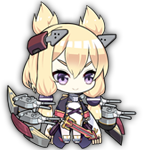 | Warspite Kai | BB | 

Backline Deleter.
Warspite makes her namesake as the backline deleter if you take her for the exercises. Otherwise, she has crazy high accuracy that's terrifying, and overall powerful.

| 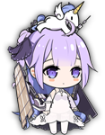 | Unicorn | CVL | 

The little cutie of healers.
Unicorn is an excellent defense-focused CVL that heals your vanguard every time her aircraft launch.

| 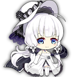 | Illustrious | CV | 

My god those boobs... *cough*
In all seriousness, Illustrious is a defense-oriented CV, having 2 fighter slots and a skill that protects your vanguard from all damage for a few seconds when her aircraft launch.

| Chibi | Name | Class | Reason 
| --- | --- | --- | --- |
| 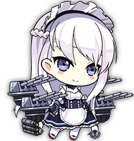 | Belfast | CL | 

Poster maid of the HMS fleet.
Belfast buffs her HE damage (shells only), and lays down a smokescreen to incease evasion from airstrikes. Decent boat to have.

| 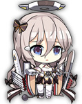 | Fortune Kai | DD | 

Cute little back line protector.
She has a chance to evade all incoming attacks, and she helps your backline defense a little bit. *But please, stay quiet when you're fighting...*

| 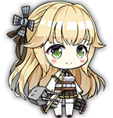 | Aurora | CL | 

Sweet, charming cruiser.
Her skill buffs her damage to small boats like destroyers, torpedo boats, etc... She also debuffs the evasion of enemy destroyers and light cruisers so long as she's alive.

## Iron Blood / KMS
### Ryuu
| Chibi | Name | Class | Reason 
| --- | --- | --- | --- |
| 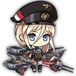 | Bismarck | BB | 

She hits hard, buffs your carrier, and helps Tirpitz.
Bismarck helps Tirpitz get over her social anxiety while buffing all of your Iron Blood ships and vanguard. On top of that, she has a decent barrage when she's flagship.

| 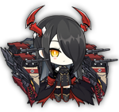 | Friedrich der Grosse | BB | 

Eternal Sonata of Chaos
She's a flagship by her own rights, being one of the most powerful KMS BB's in the game. Equip her right and she sing songs to glory for your KMS fleet.

| 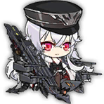 | Graf Zeppelin | CV | 

The pinnacle of KMS carriers, she helps your vanguard too.
Graf Zeppelin is a good carrier to have. Not only does she buff your vanguard by reducing the damage they take, she gets a buff herself for each KMS ship up to a stack of 3. Equip her with KMS Aircraft and she'll carry you to glory.

| Chibi | Name | Class | Reason 
| --- | --- | --- | --- |
| 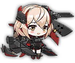 | Roon | CA | 

An oddball that switches ammo types.
Roon is not only a yandere (and scary at that), but she's odd that her main gun switches ammo types betwen AP and HE. Not bad to use, but situational at times. She does have a powerful barrage that is both AP and HE that fires in three directions. Oh, and she spawns shields.

| 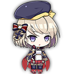 | Z23 Kai | DD | 

Hard-hitting gunboat with weak torps.
Z23 hits hard and fast, rivaling that of even CL's. She has a powerful AP barrage that also launches torps, and even spawns a helpful pair of shields to block incoming fire. Just don't rely on the shields too much.

| 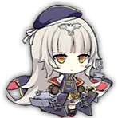 | Z46 | DD | 

Feisty little boat with that barrage of hers.
She's a feisty one, as her AP barrage gets a buff from her skill (but for the love of Cubes, do not equip an AP gun on her; DD's do not like AP guns), and she can hit rapidly too. Oh, and she buffs herself every time she fires down a plane. Buff timer resets every time, but does not stack.

## Submarines
*Subs are in a class of their own as they provide supplemental torpedo power. They can help if you have the extra oil to spare. In many cases, their barrages won't matter much, so put your favorite submarine as the first slot if you want.*

*Slower torps are recommended to use because they are more likely to hit than standard. However, if you do face more stationary bosses, then regular torpedoes could, in theory, have higher damage output.*

### Sakura Empire / IJN
| Chibi | Name | Class
| --- | --- | --- |
| 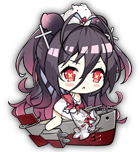 | I-168 | SS |
| 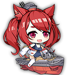 | I-19 | SS |
| 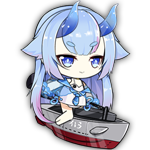 | I-13 | SSV |

### Iron Blood / KMS
| Chibi | Name | Class
| --- | --- | --- |
| 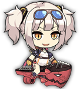 | U-96 | SS |
| 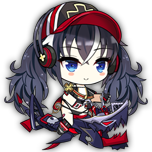 | U-101 | SS |
|  | U-81 | SS |

### Eagle Union / USS
| Chibi | Name | Class
| --- | --- | --- |
| 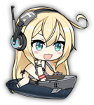 | Albacore | SS |
| 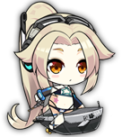 | Cavalla | SS |
| 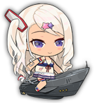 | Archerfish | SS |